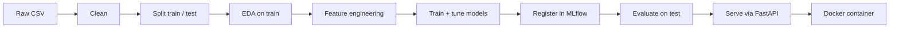

# Customer Churn Prediction

Predicts telecom customer churn from the IBM/Kaggle Telco Customer Churn dataset (~7043 rows), with a full pipeline from raw data to a served, containerized model.


## Results

| Model | F1 | ROC-AUC | Precision | Recall |
|---|---|---|---|---|
| Baseline (majority class) | 0.00 | 0.50 | 0.00 | 0.00 |
| Random Forest (tuned) | 0.6356 | 0.8457 | 0.5404 | 0.7719 |
| XGBoost (tuned) | 0.6281 | 0.8412 | 0.5561 | 0.7217 |
| **XGBoost + oversampling (registered, v2)** | **0.6392** (CV) | 0.8468 | 0.5434 | 0.7766 |
| **Final test-set evaluation (unseen data)** | **0.6317** | **0.8455** | **0.5268** | **0.7888** |

The test-set F1 lands within ~0.008 of the cross-validation estimate, and closely matches a published, leakage-free benchmark on the same base dataset (F1 = 0.6525, 10-fold CV + Random Forest + SMOTENC) — see [step 9](#pipeline-step-by-step) for the full comparison.

### Results analysis

Confusion matrix on the test set (374 actual churners, 1035 actual non-churners):

|  | Predicted: No | Predicted: Yes |
|---|---|---|
| **Actual: No** | 770 (correct) | 265 (false alarm) |
| **Actual: Yes** | 79 (missed) | 295 (correct) |

- **Recall over precision, deliberately** — the model catches 295/374 actual churners (79% recall) at the cost of 265 false alarms (53% precision). This skew comes from oversampling/`class_weight` and is the right trade-off for churn: an unnecessary retention offer to a customer who wasn't leaving is cheap; failing to flag a customer who *was* about to leave is the expensive mistake.
- **What drives the predictions** — consistent with the EDA (`notebooks/eda.ipynb`): `Contract` type and `tenure` are the strongest signals. Month-to-month contracts and low-tenure (newer) customers churn at a much higher rate than customers on one/two-year contracts or with long tenure — the "Fiber optic, month-to-month, new customer" example in [Serving the model](#serving-the-model) scores 88% churn probability for exactly this reason.
- **Known limitations** — the dataset is a single static snapshot (no time dimension), so the model can't detect trends or seasonality, and it will degrade over time as real customer behavior drifts from what it was trained on. Precision of 53% also means that a significant number of the customers flagged as "at risk" are false alarms — fine for a low-cost intervention (an email, a call), less fine if the retention action itself is expensive.

## Table of contents

- [Quick start](#quick-start)
- [Pipeline overview](#pipeline-overview)
- [Project structure](#project-structure)
- [Pipeline, step by step](#pipeline-step-by-step)
- [Key architectural decisions](#key-architectural-decisions)
- [Serving the model](#serving-the-model)
- [Running with Docker](#running-with-docker)
- [Experiment tracking](#experiment-tracking)
- [Testing](#testing)
- [Linting & formatting](#linting--formatting)
- [Out of scope](#out-of-scope)

## Quick start

```
poetry install
poetry run pre-commit install
```

Reproduce the full pipeline end to end:

```
poetry run python scripts/prepare_data.py
poetry run python scripts/split_data.py
poetry run python scripts/build_features.py
poetry run python scripts/train_model.py
poetry run python scripts/tune_model.py
poetry run python scripts/tune_model.py --oversample
poetry run python scripts/register_models.py
poetry run python scripts/evaluate_model.py
```

`register_models.py` registers the current best model (`churn_xgboost` v2, oversampled) by default; the original Random Forest / XGBoost v1 registration calls are kept in the file (commented out in `main()`) for reference/reproducibility, not re-run automatically.

## Pipeline overview



## Project structure

```
data/
├── raw/          # raw data, untouched
├── interim/      # cleaned data + train/test split
└── processed/    # final, encoded data, ready for the model
models/           # fitted encoder (models/encoder.joblib), regenerated by build_features.py
notebooks/
└── eda.ipynb     # quick raw-data audit + in-depth EDA on train
scripts/          # pipeline orchestration (entry points, no business logic)
src/customer_churn/
├── api/          # FastAPI app serving the registered model
├── data/         # loading, cleaning
├── features/     # imputation, encoding
└── models/       # training, evaluation, MLflow logging
tests/            # unit tests for the project's own logic
Dockerfile        # multi-stage build for the API
```

## Pipeline, step by step

1. **Technical cleaning** (`scripts/prepare_data.py`) — dtype conversion (`TotalCharges` string → numeric), exact duplicate removal, filtering out impossible values (negative tenure, etc.). Saves `data/interim/cleaned.csv`.
2. **Train/test split** (`scripts/split_data.py`) — 80/20, stratified on `Churn`, done **before** the in-depth EDA.
3. **EDA** (`notebooks/eda.ipynb`) — quick audit on raw data (dtypes, duplicates, missing values), then in-depth analysis on train only (distributions, correlations, churn rate by category, the missing-`TotalCharges` pattern).
4. **Feature engineering** (`scripts/build_features.py`) — `TotalCharges` imputation (→ 0, justified by the pattern found in EDA: only occurs for brand-new customers, `tenure=0`), one-hot encoding (fit on train only, applied to test). Saves to `data/processed/`.
5. **Initial training + tracking** (`scripts/train_model.py`) — baseline (`DummyClassifier`), Random Forest, XGBoost, compared via cross-validation, logged to MLflow. Both models clearly beat baseline; XGBoost slightly ahead with default parameters.
6. **Hyperparameter tuning** (`scripts/tune_model.py`) — Random Forest and XGBoost, both tuned via Optuna (Bayesian/TPE search, 25 trials each, optimizing F1), search spaces including `class_weight`/`scale_pos_weight` to address class imbalance. Every trial logged to MLflow as a nested run. Result: Random Forest ends up ahead after tuning (F1 = 0.6356 vs. XGBoost's 0.6281) — the opposite of the untuned comparison, which is why both were tuned instead of just the initial winner.
7. **Model registration** (`scripts/register_models.py`) — both tuned models retrained on the full train set and registered in the MLflow Model Registry (`churn_random_forest` v1, `churn_xgboost` v1), giving a solid, versioned checkpoint before trying further improvements.
8. **Oversampling variant** (`scripts/tune_model.py --oversample`) — retried tuning with `RandomOverSampler` (not SMOTE — chosen deliberately to sidestep the invalid-fractional-values problem SMOTE's interpolation causes on one-hot encoded columns), wrapped in an `imblearn.Pipeline` so resampling only ever touches the CV training fold, never validation. Result: XGBoost improves to F1 = 0.6392 (new best); Random Forest gets slightly worse (0.6336), since `class_weight="balanced"` was already covering most of that benefit for it. The improved XGBoost was registered as `churn_xgboost` v2.
9. **Sanity-checked against leakage and published results** — audited the whole pipeline for the specific mistake that inflates many public results on this dataset (applying SMOTE/scaling/encoding before the train/test split or outside the CV loop) and confirmed our pipeline avoids it. Cross-referenced F1 = 0.6392 against a study using the same base dataset with a properly leakage-free method (10-fold CV, Random Forest + SMOTENC): they report F1 = 0.6525 — closely matching ours, which is good evidence our number is a genuine, unleaked result rather than something being left on the table by a methodology mistake.
10. **Final evaluation** (`scripts/evaluate_model.py`) — `churn_xgboost` v2 loaded straight from the MLflow Model Registry (not retrained) and scored, once, on the held-out test set (never touched before this point). Result: F1 = 0.6317, ROC-AUC = 0.8455, precision = 0.5268, recall = 0.7888 — very close to the CV estimate (0.6392), confirming the CV score generalizes and wasn't inflated. The precision/recall split is intentional fallout from oversampling: the model catches 295/374 actual churners (79% recall) at the cost of more false alarms (265 false positives) — a reasonable trade-off for churn, where missing a real churner is usually costlier than an unnecessary retention outreach.
11. **Serving** (`src/customer_churn/api/`) — a small FastAPI app exposing `POST /predict`: takes raw customer fields (the pre-encoding schema), applies the same imputation + the fitted encoder (persisted by `build_features.py` to `models/encoder.joblib`, not refit at request time), then scores with `churn_xgboost` v2. Model and encoder are lazy-loaded (first request, not at startup) and injected via FastAPI's dependency system, so tests can substitute fakes without touching real artifacts. See [Serving the model](#serving-the-model) below.
12. **Containerized** (`Dockerfile`) — multi-stage build (Poetry only in the build stage, not the final image), runs as a non-root user, model/encoder/MLflow artifacts baked into the image for a self-contained `docker run`. See [Running with Docker](#running-with-docker).

## Key architectural decisions

A few decisions we deliberately insisted on along the way:

- **Split before EDA** — in-depth EDA runs only on train, not the full dataset, so decisions (outlier handling, imputation) aren't informed by data that should stay "unseen" until final evaluation.
- **Cleaning vs. imputation, kept separate** — `cleaning.py` only does "blind" operations (dtypes, duplicates, impossible values) that don't depend on any pattern discovered in the data. Imputation lives separately, in `features/`, explicitly justified by a finding from EDA rather than assumed upfront.
- **Same CV folds across all models** — a single `StratifiedKFold` reused for every comparison, so score differences between models come from the model itself, not from lucky splits.
- **MLflow with SQLite backend** (not file-based) — chosen specifically to enable the Model Registry (formal model versioning) at the tuning/final-model stage.
- **RandomOverSampler over SMOTE/SMOTENC** — given the moderate class imbalance (73.5/26.5) and that `class_weight`/`scale_pos_weight` already captured part of the benefit, plain oversampling (no interpolation, so no invalid values on one-hot columns) was judged a better cost/benefit than SMOTENC's added complexity.
- **Model/encoder loaded via dependency injection, lazily** — enables API tests with fake models (fast, no real artifacts needed, CI-safe), at the cost of the server no longer failing fast at startup if an artifact is missing (fails on first request instead).

## Serving the model

Start the API (run from the project root):

```
poetry run uvicorn customer_churn.api.main:app --app-dir src --host 127.0.0.1 --port 8000
```

Requires `models/encoder.joblib` to exist first — generated by `poetry run python scripts/build_features.py`. The server stays in the foreground; **stop it with `Ctrl+C`** in that terminal. To run it in the background instead, add `&` at the end (or open a separate terminal) and stop it later with `kill <pid>` (or Ctrl+C in whichever terminal is running it).

**To send a request from the browser** (no terminal/curl needed): open `http://127.0.0.1:8000/docs` — FastAPI's interactive Swagger UI. Click on **`POST /predict`** to expand it, click **"Try it out"**, edit the example JSON body with a customer's data, then click **"Execute"**. The response (prediction + churn probability) appears right below.

## Running with Docker

Build the image (run from the project root, requires `models/encoder.joblib`, `mlflow.db`, and `mlruns/` to already exist — see [Quick start](#quick-start)):

```
docker build -t customer-churn-api:latest .
```

Run it:

```
docker run -d --name customer-churn-api -p 8000:8000 customer-churn-api:latest
```

Same interface as running locally — `http://127.0.0.1:8000/docs` for the interactive Swagger UI, or `POST /predict` directly. Manage the container with:

```
docker ps                          # is it running?
docker logs customer-churn-api     # view logs
docker stop customer-churn-api     # stop
docker start customer-churn-api    # resume (same config, no need to `run` again)
docker rm customer-churn-api       # remove (needed before a fresh `docker run` with the same name)
```

The image is self-contained — it bakes in the fitted encoder and the registered model/MLflow artifacts at build time, rather than fetching them from a live registry at startup. That's a simplification appropriate for local/demo use; a production setup would instead point the container at a network-accessible MLflow server so new model versions don't require an image rebuild.

## Experiment tracking

```
poetry run mlflow ui --backend-store-uri sqlite:///mlflow.db
```

Opens a local dashboard at `http://localhost:5000`. Use the **"Model training"** tab (not "GenAI") to see runs, params, and metrics. Tracking metadata lives in `mlflow.db`; the actual model artifacts live in `mlruns/` — both are local-only in this setup and must be kept together (deleting one breaks the other).

## Testing

```
poetry run pytest
```

Unit tests only for the project's own logic (cleaning, imputation, encoding, oversampling pipeline construction, evaluation metrics, the `/predict` API contract with a fake model/encoder injected) — not for functions that mainly orchestrate MLflow/Optuna (`train_and_log`, `tune_with_optuna`, `train_and_register`), which are verified by actually running them instead.

## Linting & formatting

```
poetry run ruff check .
poetry run ruff format .
```

Runs automatically on every commit (pre-commit hook, with `--fix`).

## Out of scope

Discussed but deliberately not implemented, given the project's scope (local demo, not a production deployment):

- **Prediction logging / drift monitoring** — the API doesn't log requests anywhere; there's no record of what it's been asked to predict, so no data/prediction drift detection (e.g. with [Evidently](https://www.evidentlyai.com/)) is possible without adding that first.
- **CD (continuous deployment)** — CI runs lint + tests on every push; nothing deploys automatically anywhere, since there's no live hosting target configured.
- **A live MLflow server** — the model registry runs on a local SQLite backend, which is why the Docker image bakes in the model artifacts directly rather than fetching them from a network-accessible registry at startup (see [Running with Docker](#running-with-docker)).
